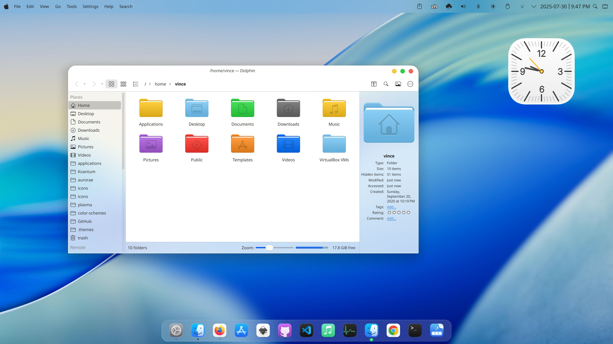
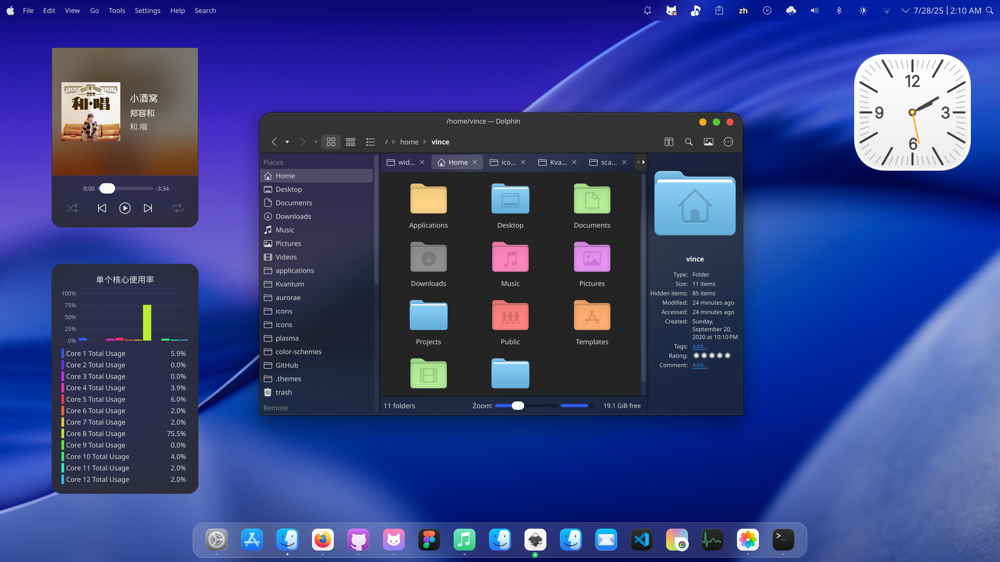

# Changes

- `desktoptheme`: Changed the dark panel color to fit the rest of the theme.
- `color-schemes`: Added more transparency (might make text harder to read).
- `custom/Konsole`: Added a profile and color-scheme for Konsole (must be added manually to `~/.local/share/konsole/`)
- `custom/KWrite`: Added a color-scheme for KWrite (must be added manually to `~/.local/share/org.kde.syntax-highlighting/themes/`)
- Renamed all instances of "MacTahoe" to "MacTahoeCustom" to prevent clashing with the original theme (except for vinceliuice/MacTahoe to prevent breaking links).

#  MacTahoeCustom KDE Theme

MacTahoeCustom kde is a MacOS Tahoe like theme for KDE Plasma desktop.

## Donate

If you like my project, you can donate at:

<span class="paypal"><a href="https://www.paypal.me/vinceliuice" title="Donate to this project using Paypal"></a></span>

## Installation

```sh
./install.sh
```

## My plasma shell settings


## Recommendations

- For gtk app blur Effect you can use this extension [kwin-effects-forceblur](https://github.com/taj-ny/kwin-effects-forceblur).

    Go to `System Sttings` > `Window Management` > `Desktop Effects` > `Better Blur` turn it on
    1. Open `Better Blur` Configure window > `Force blur` active `Blur all except matching`

    2. Open `Rounded corners` > set window top corner radius to `24` and window bottom corner radius to `24`


- For better looking please use this pack with [Kvantum engine](https://github.com/tsujan/Kvantum/blob/master/Kvantum/INSTALL.md#distributions).

    Run `kvantummanager` to choose and apply **MacTahoeCustom** theme.

- Install [MacTahoeCustom icon theme](https://github.com/vinceliuice/MacTahoe-icon-theme) for a more consistent and beautiful experience.

- Install [MacTahoeCustom cursors theme](https://github.com/vinceliuice/MacTahoe-icon-theme/tree/main/cursors) for a more consistent and beautiful experience.

## preview



